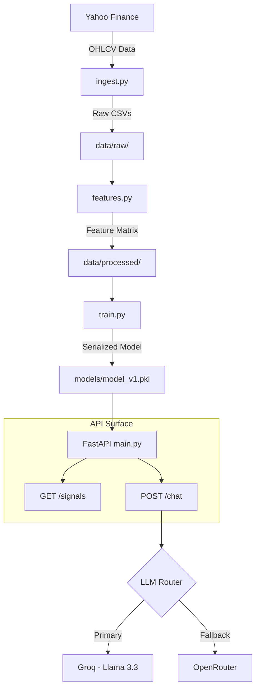

# ⚡ NiftyEdge API

[](https://fastapi.tiangolo.com/)
[](https://xgboost.ai/)
[](https://groq.com/)


**NiftyEdge API** is a high-performance, machine-learning powered backend engine designed for swing trading discovery in the Nifty 50 universe. It leverages an XGBoost classifier to predict short-term bullish breakouts and integrates an LLM-based "AI Analyst" to provide qualitative context on trade setups.

🌐 **Frontend:** [niftyedge.netlify.app](https://niftyedge.netlify.app)

---

## 🚀 Key Features

*   **Predictive Intelligence** — Identifies stocks likely to gain ≥1.5% within the next 5 trading days using an XGBoost classifier.
*   **Deep Technical Context** — Processes 12+ technical features including RSI, MACD, Bollinger Bands, Volume Ratios, and Relative Strength vs Nifty.
*   **AI-Powered Analyst** — A conversational agent powered by **Groq (Llama 3.3 70B)** that interprets signals and provides institutional-grade trade commentary.
*   **Institutional Backtesting** — Rigorous simulation logic with transaction friction, take-profit/stop-loss management, and walk-forward validation.
*   **Hybrid Fallback Architecture** — Intelligent LLM routing via Groq with OpenRouter fallback to ensure high availability for the chat interface.

---

## 🏗️ Architecture & Data Flow



---

## 📡 API Reference

### 1. Health Probe
`GET /health`
Validates the API is live and the model is loaded.
```json
{ "status": "ok" }
```

### 2. Market Signals
`GET /signals`
Returns current trade signals where model probability exceeds the **0.55 threshold**.
> [!NOTE]
> Signals are cached for 15 minutes by default to reduce latency and Yahoo Finance API hits.

**Sample Response:**
```json
[
  {
    "ticker": "RELIANCE.NS",
    "date": "2026-04-13",
    "probability": 0.712,
    "sector": "Energy",
    "rsi": 54.2,
    "volume_ratio": 1.63,
    "bb_position": 0.45,
    "sector_momentum": 0.018,
    "rs_vs_nifty": 3.1
  }
]
```

### 3. AI Analyst Chat
`POST /chat`
Asks the AI analyst for a breakdown of today's signals.
**Request Body:**
```json
{
  "message": "Which of these has the cleanest setup?",
  "signals": [...],
  "history": []
}
```

---

## 🧠 Model Specifications

### Algorithm & Target
- **Classifier:** XGBoost (`n_estimators=200`, `max_depth=4`, `learning_rate=0.05`)
- **Target Variable:** Binary (1 if Max Close in 5 days ≥ 1.5% above entry, else 0)
- **Validation:** Walk-forward rolling folds (6 months) to ensure out-of-sample robustness.

### Feature Engineering
The model is trained on a 12-dimensional feature space:
| Feature | Description |
| :--- | :--- |
| `RSI` | Relative Strength Index (14-day) |
| `BB_Position` | Price position within Bollinger Bands (0-1) |
| `Volume_Ratio` | Today's volume vs 20-day average |
| `RS_vs_Nifty` | Stock RSI - Nifty 50 Index RSI |
| `Sector_Momentum` | Avg. 10-day return of sector peers |
| `MACD / Signal` | Moving Average Convergence Divergence |

---

## 🛠️ Local Development

### 1. Installation
```bash
git clone https://github.com/AakashVijeta/NiftyEdge-api.git
cd NiftyEdge-api
python -m venv venv
# Windows: venv\Scripts\activate | Unix: source venv/bin/activate
pip install -r requirements.txt
```

### 2. Configuration
Create a `.env` file in the root directory:
```env
GROQ_API_KEY=your_key_here
OPENROUTER_API_KEY=your_key_here
SIGNALS_CACHE_TTL=900
```

### 3. Execution
```bash
uvicorn main:app --reload
```

---

## 📈 Pipeline Workflow

To refresh data or retrain the model from scratch, execute the following pipeline:

1.  **Ingestion:** `python ingest.py` — Fetches latest OHLCV data.
2.  **Featurization:** `python features.py` — Computes technical indicators.
3.  **Training:** `python train.py` — Runs walk-forward validation and exports `model_v1.pkl`.
4.  **Backtesting:** `python backtest.py` — Generates PnL reports and trade logs.

---

## ⚠️ Disclaimer

NiftyEdge is an **educational and research project**. The signals generated are probabilistic outputs from a machine learning model and do **not** constitute financial advice. Trading involves significant risk. Always perform your own due diligence.
erformance does not guarantee future returns. Use at your own risk.
